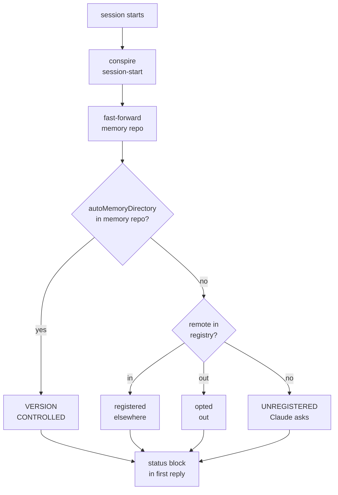
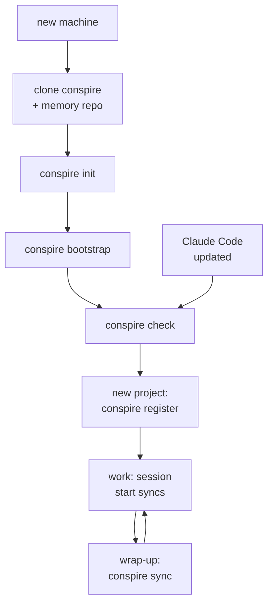

# conspire

You have multiple projects and/or multiple machines. Conspire to keep your
agent (primarily Claude Code) instruction files, settings, and auto-memory in
one place: your private git repo easily synced across machines.

- Your memories are valuable: back them up
- Your settings and configurations ensure continuity of experience: share them across machines and projects
- Your single source of memory: give yourself and your agents a view across projects

## Why?

Anthropic declined to build cross-machine memory sync
([claude-code#56793](https://github.com/anthropics/claude-code/issues/56793),
closed "not planned").

The conspire approach is simple: Your project memories are stored as markdown and synced to your private git repo. Additional benefits result from this.

Are we reinventing the wheel? Why not collaborate with its inventor? See [free_market.md](free_market.md) for some comparisons.

## How?

First and foremost, conspire is separate from your memories. This public repo _details here_ manages local references to your memory repo. Your memory repo is only known to you. (Future support my be available for multiple memory repos which then group projects, eg "my_memories_work" and "my_memories_personal").

From a user perpsective (address instruction files, settings/configs, and memory):

- what happens on install?
- what happens when I start a new project?
- what happens when I

adsf

- — it holds what Claude knows about
  you and your work), created by `conspire init --new` from
  `templates/memory_repo/`:
- `claude/CLAUDE.md`: your global instructions to Claude, the
  ones that apply in every project. Claude Code reads it from
  `~/.claude/CLAUDE.md`, which becomes a one-line pointer here.
- `claude/settings.json`: Claude Code's user settings (permissions,
  hooks, model). Carries the session-start hook that makes all of
  this run.
- `memory/<store>/`: one folder of memory files per project. What
  Claude remembers about that project, one fact per file, on every
  machine.
- `memory-registry.tsv`: one row per project you've answered the
  in-or-out question for, keyed by the project's git remote URL —
  so each machine knows the answer without asking again.

## How it works

Every session start syncs the memory repo, works out which memory store
this project uses, and tells Claude:

Claude Code reads `~/.claude/`; the memory repo reaches it through four
thin mechanisms, created by `conspire bootstrap`:

1. `~/.claude/<name>.md` is a one-line stub `@~/<memory_repo>/claude/<name>.md`
   for every `claude/*.md` in the memory repo. User-scope imports load
   without approval dialogs and work on Windows where symlinks don't.
2. `~/.claude/settings.json` is a symlink into the memory repo (copy on
   Windows; `conspire check` flags drift). Settings have no import
   mechanism. The template's settings carry the two session hooks.
3. `~/.claude/output-styles` and `~/.claude/skills` are symlinks to the
   memory repo directories of the same name, if present.
4. Each opted-in project's `.claude/settings.local.json` (untracked)
   sets `"autoMemoryDirectory": "~/<memory_repo>/memory/<name>"` — the
   documented setting that redirects auto memory. All clones of a
   project on all machines name the same store.

## Your memory repo, by example

`~/my_claude_memories` after registering two projects and opting a
third out:

    ~/my_claude_memories/
      claude/
        CLAUDE.md            ~/.claude/CLAUDE.md is a stub: "@~/my_claude_memories/claude/CLAUDE.md"
        settings.json        ~/.claude/settings.json symlinks here; carries the session hooks
        output-styles/       optional; ~/.claude/output-styles symlinks here
        skills/              optional; same
      memory/
        pywatershed/         store for every clone of pywatershed, on every machine
          MEMORY.md          generated index -- never hand-edited
          prms-input-paths.md
          conda-envs.md      names machine tags: "on LaNueva ... on the cluster ..."
        conspire/
          MEMORY.md
          release-plan.md
      memory-registry.tsv    3 rows: pywatershed in, conspire in, scratch-repo out
      README.md

## What do I run, when?

    new machine          clone both repos; conspire init; bootstrap; check
    new project          cd into it; conspire register (asked once per repo family)
    starting a task      nothing — session start syncs and prints the status block
    task / session done  conspire sync
    updated Claude Code  conspire check  (BROKEN lines -> conspire bootstrap)

## What happens at session start

`SessionStart` runs `conspire session-start`: it syncs the memory repo
(so this machine reads what other machines learned), then prints a
status block — machine tag, project, memory state — that Claude
surfaces in its first reply (the template `CLAUDE.md` tells it how).
`SessionEnd` only stamps `.session-end.log`, by design: the harness
kills the hook within a second or two and its output goes nowhere, so
a sync failure there would be invisible. Run `conspire sync` by hand
at wrap-up; the next session start sweeps up anything missed.
`sync` never merges: fast-forward or report.

The memory line of the status block comes from, in order: the
project's `autoMemoryDirectory` (VERSION CONTROLLED if it points into
the memory repo), else the project's remote URLs matched against
`memory-registry.tsv` (opted out, or registered on another machine),
else UNREGISTERED — Claude asks, `conspire register` records the
answer, and the registry syncs so the question is asked once.

## Machine identity

The tag is **chosen, not detected** — hostname only seeds the prompt's
default. Every commit to the memory repo gets a `Machine:` trailer; any
memory stating machine-specific facts (paths, environments, which
clone holds which branch) should name the tag in prose.

## The index is generated

`MEMORY.md` is a pure function of the store's files: the pre-commit
hook rebuilds it from each memory's `name:`/`description:` frontmatter
and stages it. Never edit it; write good `description:` fields instead.
This removes the natural merge conflict (two machines appending lines
to one file). The generator hard-fails past Claude Code's load limits
(200 lines / 25KB), because content beyond them silently never loads.

`inbox/` subdirectories are excluded from the index: drafts from
harnesses that can't be trusted to write memory unattended. Review =
promote to a top-level file or delete.

## Kiro adapter

Everything attached to git — the store format, index generator, both
git hooks, the registry, machine tags — works wherever git works. Only
the session wiring is Claude-Code-specific. Kiro's sandbox additionally
cannot read the memory repo at all, so `conspire kiro-sync` bridges by
copying: a read-only mirror under `~/.kiro/conspire/` (memory, claude,
the registry, the machine tag), steering from `templates/kiro/steering/`
plus the memory repo's own `kiro/steering/*.md` into `~/.kiro/steering/`,
and drafts flowing back from `~/.kiro/conspire/inbox/<store>/` into
`memory/<store>/inbox/`. It exits quietly where `~/.kiro` is absent.

    conspire kiro-sync                                  # by hand
    */15 * * * * "$HOME/.local/bin/conspire" kiro-sync >> /tmp/kiro-sync.log 2>&1

Steering files must keep their `---` frontmatter as the very first
bytes — Kiro ignores them otherwise.

## Never commit

Transcripts. Only instruction files and `memory/` content belong in the
memory repo. The `*.jsonl` files under `~/.claude/projects/` are full
conversation logs and never leave the machine (the template
`.gitignore` blocks the extension as a backstop).

## Watch out

- Trust boundary: session start pulls the memory repo, and `sync`'s
  `git add -A` commits whatever it finds there. Keep it private.
  Code only ever runs from this tool repo, which you update by hand.
- A project with no git remote is registered by a `path:` row, which
  matches only on machines sharing that exact path.
- Installers that rewrite `~/.claude/CLAUDE.md` in place (CodeGraph
  does) replace the stub with a real file; `conspire check` catches it:
  re-run `conspire bootstrap`, then merge what the installer wrote into
  your memory repo's `claude/CLAUDE.md`.
- Divergence (`sync` reports "cannot fast-forward"):
  `cd <memory_repo> && git pull --rebase` — per-file memories and the
  generated index make real conflicts rare.
- Cowork desktop sessions ignore user-scope external imports; a
  machine using Cowork needs a real `~/.claude/CLAUDE.md`.
- Upgrading from a conspire that wrote `~/.conspire/home`: it is now
  `~/.conspire/memory_repo` and `$CONSPIRE_HOME` is
  `$CONSPIRE_MEMORY_REPO`. Re-run `conspire init <your repo>` once.

## Install

    git clone https://github.com/jmccreight/conspire.git ~/conspire
    ~/conspire/bin/conspire init --new ~/my_claude_memories   # or: init <existing repo>
    ~/conspire/bin/conspire bootstrap
    conspire check

Prereqs: git, python 3.12+ (stdlib only), bash (Git Bash on Windows).
`bootstrap` links `~/.local/bin/conspire`; put `~/.local/bin` on PATH
if it isn't. Then, inside each project you work on:

    conspire register        # answer: in (version-controlled) or out (local)

Push the memory repo to a private remote when ready; sync works without one.

## Layout of this repo

    bin/conspire            launcher: find python, exec conspire.py
    bin/find_python.sh      $CONSPIRE_PYTHON, then python3/python on PATH
    conspire.py             all the machinery (one subcommand per entry point)
    hooks/                  git hooks served to the memory repo (core.hooksPath)
      prepare-commit-msg    appends "Machine: <tag>" trailer
      pre-commit            regenerates + validates every MEMORY.md
    templates/memory_repo/         starter memory repo
    templates/kiro/         steering for the Kiro adapter

Machine-local state, all under `~/.conspire/`: `memory_repo` (path of the
memory repo; `$CONSPIRE_MEMORY_REPO` overrides) and `machine` (this machine's
tag; `$CONSPIRE_MACHINE` overrides).
